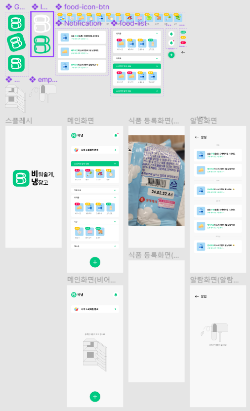
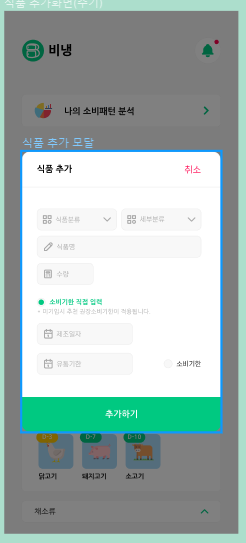
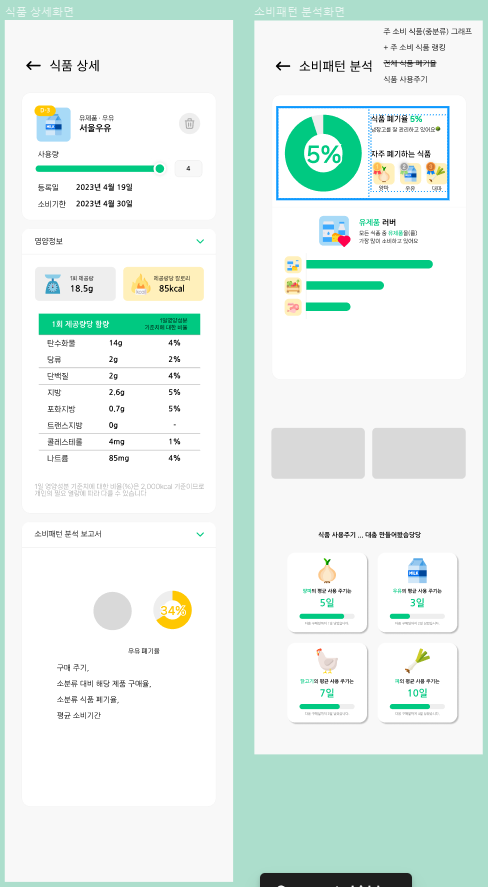

<span>2023-04-17</span>

# TanStack Query(React Query)

<div style="display: flex; background-color: rgba(255, 255,255, 0.1); padding: 8px 16px; border-radius: 8px;">
    <div style="margin-right: 8px">💡</div>
    <div>
    <b>react-query</b>는 v4 버전부터 <b>TanStack Query</b>로 명칭이 정정되었습니다.
    <br>
    현재는 v4 버전이 메이저 버전이며, v3과의 차이점은 <a href="https://tanstack.com/query/v4/docs/react/guides/migrating-to-react-query-4">여기</a>서 확인할 수 있습니다.
    <br>
    <b>TanStack Query</b>의 전체적인 내용이 궁금하다면 공식문서 링크 <a href="https://tanstack.com/query/v4/docs/react/overview">여기</a>를 참고해주세요!
    </div>
</div>

<br>
<br>

## TanStack Query란 무엇인가

### 기존 state 관리의 한계점

- 기존에는 컴포넌트 기반 state, React hooks, 상태관리자(Redux 등)를 통해 데이터를 관리해왔음
- 이러한 방식은 `client state`를 처리하는 데는 효과적이었으나 `server state`처리에는 효과적이지 못함
  > ### Client state? Server state?
  >
  > - client state : input 값과 같이 클라이언트가 자체적으로 생성한 상태
  > - server state : DB 내 데이터와 같이 클라이언트에 표시되는 서버의 데이터

<br>

### Server State의 관리를 위해

`server state`의 관리에서 발생할 수 있는 문제는 아래와 같습니다.

- 캐싱
- 동일 데이터 요청에 대한 중복 요청 제거
- 백그라운드에서 `out of date` 데이터 업데이트
- 데이터의 `out of date` 파악
- 신속한 데이터 업데이트 반영
- pagination, laxy loading 등의 성능 최적화
- 메모리와 server state의 가비지 컬렉션 관리
- 구조 공유(structural sharing)를 사용하여 쿼리 결과를 저장

**TanStack Query**는 이러한 `server state` 관리의 어려움을 해결해주기 위해 등장한 라이브러리입니다.

<br>
<br>

## Installation

```javascript
$ npm i @tanstack/react-query

// 아래는 선택사항
$ npm i @tanstack/react-query-devtools
```

## useQuery

```javascript
import { useQuery } from "@tanstack/react-query";

function App() {
  const info = useQuery({ queryKey: ["todos"], queryFn: fetchTodoList });
}
```

- queryKey : 내부적으로 사용하는 키
- queryFn : 실행시키고자 하는 비동기 함수

위의 코드에서는 `info`에 queryFn의 결과값이 저장됩니다.
여기서 `info`로 볼 수 있는 데이터는 아래와 같습니다.

- isLoading
- isError
- isSuccess
- error
- data

따라서 아래와 같이 사용할 수 있습니다.

```javascript
function Todos() {
  const { isLoading, isError, data, error } = useQuery({
    queryKey: ["todos"],
    queryFn: fetchTodoList,
  });

  if (isLoading) {
    return <span>Loading...</span>;
  }

  if (isError) {
    return <span>Error: {error.message}</span>;
  }

  // We can assume by this point that `isSuccess === true`
  return (
    <ul>
      {data.map((todo) => (
        <li key={todo.id}>{todo.title}</li>
      ))}
    </ul>
  );
}
```

또는 이런 식으로 사용할 수 있습니다.

```javascript
function Todos() {
  const { status, data, error } = useQuery({
    queryKey: ["todos"],
    queryFn: fetchTodoList,
  });

  if (status === "loading") {
    return <span>Loading...</span>;
  }

  if (status === "error") {
    return <span>Error: {error.message}</span>;
  }

  // also status === 'success', but "else" logic works, too
  return (
    <ul>
      {data.map((todo) => (
        <li key={todo.id}>{todo.title}</li>
      ))}
    </ul>
  );
}
```

### status와 fetchStatus

`useQuery`의 결과값에서 앞서 언급한 **status**말고도 **fetchStatus**도 있습니다.

두 데이터의 차이를 정리하면 다음과 같습니다.

- **status** : data의 상태
- **fetchStatus** : queryFn의 실행상태

두 데이터를 조합하여 Background refetch나 stale-while-validate 동작을 모두 설명할 수 있다고 합니다! ~~무슨 소리인지 대해서는 좀 더 학습이...필요할 것같습니다~~

---

2023-04-18

# 알고리즘 문제: BOJ 3584

## GOLD 4: 가장 가까운 공통 조상

트리 만들고 root까지 올라가면서 경로를 탐색 후 이를 비교해서 얻어보자

```python
from collections import deque
import sys
input = sys.stdin.readline

class Node:
  def __init__(self, id):
    self.id = id
    self.parent = None


T = int(input())

for t in range(T):
  N = int(input())
  nodes = [Node(i) for i in range(N+1)]
  for n in range(N-1):
    (parent, child) = list(map(int, input().split()))
    nodes[child].parent = nodes[parent]


  (node1, node2) = list(map(int, input().split()))

  node1 = nodes[node1]
  node2 = nodes[node2]
  route1 = deque([node1.id])
  route2 = deque([node2.id])

  while node1.parent:
    node1 = node1.parent
    route1.appendleft(node1.id)
  while node2.parent:
    node2 = node2.parent
    route2.appendleft(node2.id)

  idx = 0
  while idx < len(route1) and idx < len(route2) and route1[idx] == route2[idx]:
    idx += 1

  print(route1[idx-1])
```


<br>

2024-04-19

# Figma를 이용한 목업디자인 진행




<br>

2024-04-20

# Figma를 이용한 목업디자인 진행

<div style="display: flex;">




</div>

